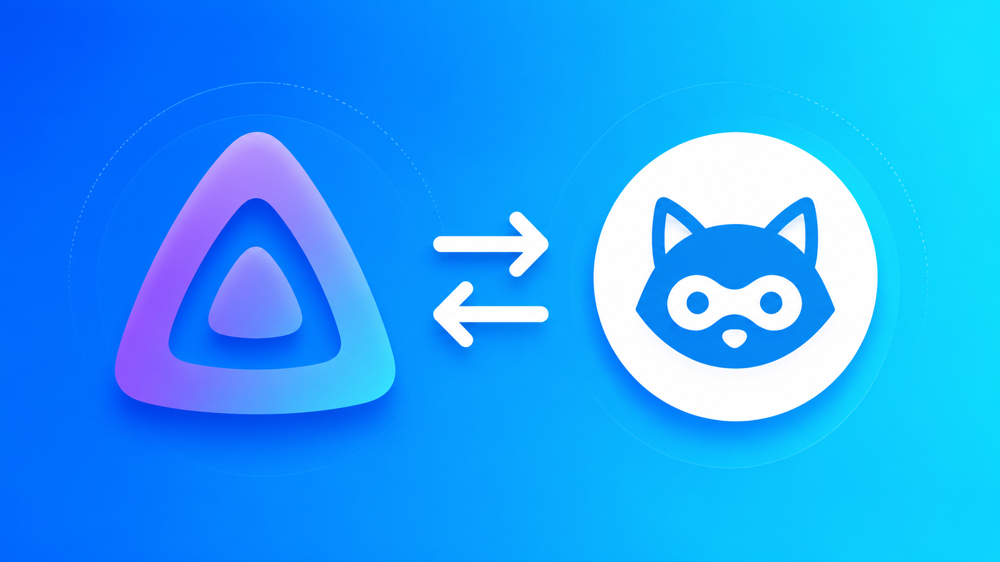

<p align="center">
  
</p>

# jellyfin-seerr-proxy

`jellyfin-seerr-proxy` is a minimal Jellyfin plugin that lets authenticated Jellyfin clients use a safe subset of the Seerr API as the currently logged-in Jellyfin user.

The plugin keeps Seerr credentials on the Jellyfin server. A client such as Wholphin calls the Jellyfin plugin endpoint with its normal Jellyfin auth token; the plugin resolves that Jellyfin user to the linked Seerr user and forwards allowlisted Seerr API calls with `X-API-User` set server-side.

## What It Does

- Exposes authenticated Jellyfin endpoints under `/Plugins/SeerrProxy`.
- Resolves the current Jellyfin user from Jellyfin authentication claims.
- Looks up the linked Seerr user with `GET /api/v1/user/jellyfin/{jellyfinUserId}`.
- Proxies allowlisted Seerr API calls for linked Jellyfin users.
- Sends `X-Api-Key` and `X-API-User` only from server-side plugin configuration and resolved identity.
- Returns clear JSON errors suitable for TV clients.

## What It Does Not Do

- It does not create Jellyfin libraries.
- It does not create placeholder media.
- It does not sync discovery content.
- It does not hook favorites or watch state.
- It does not change the Jellyfin library experience.

## Required Seerr Setup

Jellyfin users must already be imported or linked in Seerr. The plugin does not create or link Seerr users.

Create or copy a Seerr API key and store it in the Jellyfin plugin configuration page. Clients never need this key.

## Endpoints

All endpoints require Jellyfin authentication.

### `GET /Plugins/SeerrProxy/Status`

Returns plugin state and, when configured and enabled, whether the current Jellyfin user maps to a Seerr user. Secrets are never returned.

### `/Plugins/SeerrProxy/api/v1/{path}`

Allowlisted passthrough for clients that need Seerr data or requests without storing Seerr credentials locally. The plugin forwards these requests to Seerr's `/api/v1/{path}` with `X-Api-Key` and `X-API-User` set server-side.

Supported methods and route families:

- `GET auth/me`
- `GET settings/public`
- `GET search`
- `GET discover/...`
- `GET movie/{id}`, `movie/{id}/recommendations`, `movie/{id}/similar`, `movie/{id}/ratings`
- `GET tv/{id}`, `tv/{id}/recommendations`, `tv/{id}/similar`, `tv/{id}/ratings`, `tv/{id}/season/{season}`
- `GET person/{id}`, `person/{id}/combined_credits`
- `GET request`, `GET request/{id}`
- `POST request`
- `PUT request/{id}`
- `DELETE request/{id}`

Client-provided identity fields and authentication headers are ignored. Do not send `userId`, `X-API-User`, cookies, or a Seerr API key; the plugin derives the requester from Jellyfin authentication only.

### `POST /Plugins/SeerrProxy/Test`

Dashboard-only elevated endpoint used by the configuration page to test Seerr reachability and the configured API key.

## Installation

### Plugin Catalog

1. Open **Dashboard -> Plugins -> Repositories**
2. Add `https://raw.githubusercontent.com/voc0der/jellyfin-seerr-proxy/main/manifest.json`
3. Install **Seerr Proxy** from **Catalog**
4. Restart Jellyfin

### Manual Install

1. Download the latest ZIP from the releases page
2. Extract it into your Jellyfin plugins directory
3. Restart Jellyfin

## Building

Install the .NET 9 SDK, then run:

```bash
dotnet build --configuration Release
```

The plugin DLL is written to `bin/Release/net9.0/Jellyfin.Plugin.SeerrProxy.dll`.

## Release Metadata

`manifest.json` is updated by the release workflow when a new version is published.
